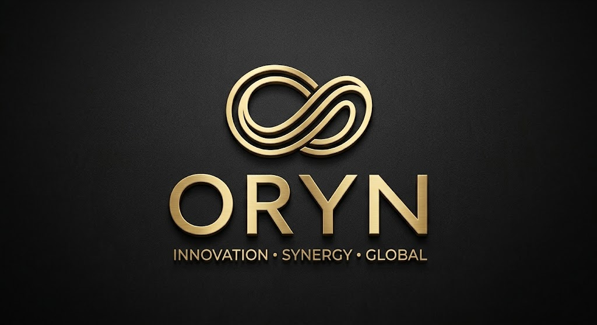

# ORYN

Assistente de IA roda **100% local** no seu computador — conversa, visão, geração de imagens e vídeos sem enviar seus dados para a nuvem.



## O que o ORYN faz

- **Chat** com IA em português do Brasil (modelo `oryn`, base Qwen3), com contexto de arquivos e busca na web.
- **Visão** — solte uma imagem e faça perguntas sobre ela (modelo `llava`).
- **Arquivos** — envie PDF, DOCX, XLSX, imagens, código, etc. e converse sobre o conteúdo.
- **Pesquisa na web** — resultados com leitura automática da página, direto no chat.
- **Imagens** — gere imagens com **FLUX.2 Klein** (1024×1024 ou outra proporção).
- **Vídeos** — **Wan 2.2 5B** (texto→vídeo e animar uma imagem) e **Wan 2.2 14B** (texto→vídeo em 720p).
- **Voz** — fale com o ORYN (reconhecimento de voz) e ouça as respostas (texto-para-fala).
- **Memória/RAG** — busca no seu acervo de documentos (ChromaDB) quando fizer sentido.

Tudo isso orquestrado por um **ComfyUI local** para a parte de mídia e pelo **Ollama** para os modelos de linguagem.

## Requisitos

| Item | Observação |
|---|---|
| Windows 10/11 | testes feitos no Windows |
| Python 3.12+ | marcado `Add python.exe to PATH` na instalação |
| Git | para clonar o ComfyUI |
| GPU NVIDIA recomendada | 8 GB+ VRAM para vídeo; FLUX.2 Klein roda em placas menores |
| ~50 GB livres em disco | modelos de chat + imagem + vídeo |
| Internet | apenas na instalação (download dos modelos) |

> Sem Ollama ou modelos, o ORYN abre mesmo assim: o chat fica indisponível, mas a interface carrega e a aba de status mostra o que falta.

## Instalação (1 clique)

Feche o ComfyUI e o Comfy-Desktop, extraia o projeto e rode:

```
install.bat
```

O instalador faz automaticamente:

1. Verifica **hardware e disco**: mede o espaço livre da unidade e a GPU (via `nvidia-smi`). Com menos de 20 GB o instalador para com erro.
2. Verifica/instala o **Ollama** (via `winget`) se faltar.
3. Baixa os **modelos de chat/visão** (`qwen3:14b`, cria `oryn:14b` a partir do `Modelfile-14b`), `llava:latest` (visão) e `nomic-embed-text` (busca/embeddings).
4. Clona o **ComfyUI** (na primeira vez), cria os ambientes Python e instala as dependências.
5. Reaproveita os modelos que você já tenha no **Comfy-Desktop** (`ComfyUI-Shared`).
6. Baixa os **modelos de geração** — **GPU fraca (menos de 8 GB VRAM) ou sem NVIDIA: instala só FLUX.2 Klein + Wan 5B (~25 GB) e pula o Wan 14B**; em máquina boa baixa tudo (~50 GB). Default **S** com 30s para responder.
7. Confere novamente o espaço antes do download (exige 25/60 GB conforme o pacote).
8. Instala no ComfyUI os **workflows prontos** FLUX.2 / Wan da pasta `comfy_workflows\defaults`.
9. Faz backup dos seus workflows existentes em `comfy_workflows\` e dá `config.json` padrão.

Modelos já existentes nunca são baixados de novo (tudo é idempotente).

## Iniciar

```
start.bat
```

Abre três processos em janelas separadas:

1. **Ollama** (se não estiver rodando) — porta `11434`.
2. **ComfyUI** — porta `8188`.
3. **ORYN (web)** — porta `8000`.

E abre o navegador em <http://127.0.0.1:8000>.

> Passe o mouse no indicador de status (canto superior) para ver o espaço livre em disco.

> Para editar os workflows no próprio ComfyUI, abra <http://127.0.0.1:8188> → aba *Workflow* — os templates FLUX.2/Wan já estão lá.

## Configuração

`config.json` (na raiz do projeto):

```json
{
  "ollamaUrl": "http://localhost:11434",
  "comfyuiUrl": "http://127.0.0.1:8188"
}
```

- **Ollama** : se você rodar o Ollama em outra máquina, aponte a URL (ex.: `http://192.168.1.10:11434`).
- **ComfyUI** : se seu ComfyUI estiver em outra máquina/porta, ajuste aqui.

Na interface: **Configurações** permite escolher o modelo de chat (`oryn:14b` como padrão automático — se vazio, usa `qwen3`), modelo de visão (`llava`), e o modelo de vídeo (`wan_5b` / `wan_14b`).

## Modelos

| Modelo | Uso | Onde |
|---|---|---|
| `oryn:14b` (base `qwen3:14b`) | chat | Ollama |
| `oryn:32b` (opcional) | chat pesado | Ollama |
| `llava` | visão (imagens) | Ollama |
| `nomic-embed-text` | busca/memória | Ollama |
| `flux-2-klein-4b` + `flux2-vae` + Qwen3 4B fp4 | imagens FLUX.2 Klein | ComfyUI |
| `wan2.2_ti2v_5B_fp16` | vídeo 5B (texto→vídeo / animar) | ComfyUI |
| `wan2.2_t2v_*_14B_fp8` + `umt5` + `wan2.2_vae` | vídeo 14B 720p | ComfyUI |

Baixar modelos manualmente: `download_models.py` (aceita `--check` para só verificar o que falta):

```
python download_models.py C:\ComfyUI\ComfyUI
python download_models.py C:\ComfyUI\ComfyUI --check
```

## Estrutura

```
ORYN/
├─ app.py                 # API Flask (chat, visão, geração, arquivos, status)
├─ install.bat            # instalador automático
├─ start.bat              # iniciador (Ollama + ComfyUI + ORYN)
├─ download_models.py     # download dos modelos de geração
├─ Modelfile-14b / -32b   # personalidade do ORYN nos modelos de chat
├─ config.json            # URLs do Ollama / ComfyUI
├─ requirements.txt       # dependências Python
├─ comfy_workflows/       # backup + templates padrão (FLUX.2 / Wan)
│  └─ defaults/
├─ frontend/              # interface web (HTML/CSS/JS)
└─ .venv/                 # ambiente Python do ORYN
```

## Solução de problemas

| Sintoma | O que fazer |
|---|---|
| Status mostra Ollama offline | Inicie o Ollama e rode `start.bat` de novo. |
| Status mostra ComfyUI offline | Confira se a porta 8188 responde; rode `start.bat`. |
| Sem modelo de visão na lista de configs | `ollama pull llava:latest` e recarregue a página. |
| Chat usa modelo errado | Em Configurações, escolha `oryn:14b` (ou `qwen3`) — o padrão é automático. |
| Geração falha por memória | Use resolução menor (ex.: 640×640 no vídeo, 832×480). Modelos 14B/32B exigem mais VRAM. |
| Baixou modelos e não aparecem | Verifique se `config.json` aponta para o ComfyUI certo e reinicie. |

## Licença

Código-fonte: licença MIT — veja [LICENSE.md](LICENSE.md).

Modelos de base e ferramentas de terceiros têm as próprias licenças: Qwen (Apache 2.0), Ollama, ComfyUI (GPL-3.0), FLUX (BLFL), Wan (Apache 2.0/ComfyUI repackaged). O nome "ORYN" e a identidade visual pertencem ao projeto.